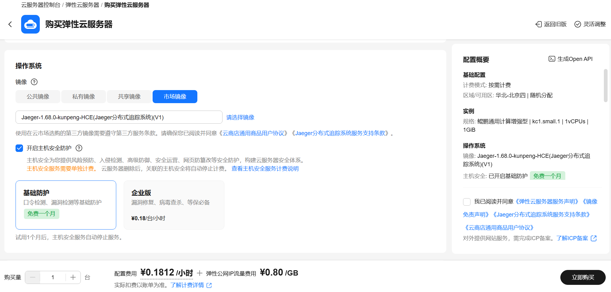

# Greenplum使用指南

# 一、商品链接

[Greenplun分布式数据库]()

# 二、商品说明

Greenplum是一个面向数据仓库应用的分布式关系型数据库，因具有良好的体系结构，在数据存储、高并发、高可用、线性扩展、响应速度、易用性和性价比等方面有非常明显的优势，被广泛应用于企业级数据仓库之中。

本商品通过鲲鹏服务器+Huawei Cloud EulerOS 2.0 64bit系统进行安装部署。

# 三、商品购买

您可以在云商店搜索“Greenplum分布式数据库”找到该商品。

其中，地域、规格、推荐配置使用默认，购买方式根据您的需求选择按需/按月/按年，短期使用推荐按需，长期使用推荐按月/按年，确认配置后点击“立即购买”。

# 四、商品资源配置

本商品支持ECS控制台配置，下面对资源配置方式进行介绍。

# 4.1 ECS 控制台配置

### 准备工作

在使用ECS控制台配置前，需要您提前配置好 **安全组规则**。

> **安全组规则的配置如下：**
>
> - 入方向规则放通端口5432，为数据库对外业务端口号，源地址内必须包含您的客户端ip，否则无法访问
> - 入方向规则放通 CloudShell 连接实例使用的端口 `22`，以便在控制台登录调试
> - 出方向规则一键放通

### 创建ECS

前提工作准备好后，在 ECS 控制台配置跳转到[购买ECS](https://support.huaweicloud.com/qs-ecs/ecs_01_0103.html) 页面，ECS 资源的配置如下图所示：

选择CPU架构

选择服务器规格

选择镜像规格


其他参数根据实际情况进行填写，填写完成之后，点击立即购买即可


> **值得注意的是：**
>
> - VPC 您可以自行创建
> - 安全组选择 [**准备工作**](#准备工作) 中配置的安全组；
> - 弹性公网IP选择现在购买，推荐选择“按流量计费”，带宽大小可设置为5Mbit/s；
> - 高级配置需要在高级选项支持注入自定义数据，所以登录凭证不能选择“密码”，选择创建后设置；
> - 其余默认或按规则填写即可。

# 五、商品使用

‌[Green‌plum](https://greenplum.org/) 是一个先进的大规模并行处理（MPP）数据仓库，专为大规模数据分析、机器学习与商业智能（BI）场景而设计。它基于 PostgreSQL 开源数据库构建，继承了其丰富的 SQL 支持和强大的功能生态。

Greenplum现已闭源，本商品基于社区留存的开源版本构建。

## 配置使用环境

### 创建用户和组

服务器环境下，单独配置用户和组可用实现权限隔离，从而保障系统安全。

```
groupadd gpadmin
useradd -g gpadmin gpadmin
```

设置gpadmin用户的密码，根据提示输入两次相同的密码。

```
passwd gpadmin
```

### 创建数据目录并赋权

为Greenplum创建数据目录，如有需要可以自行挂载数据盘以测试性能。

```
mkdir -p /home/gpadmin/segdata
mkdir -p /home/gpadmin/master
```

需修改数据目录的权限，确保正常使用，如下所示。

```
chown -R gpadmin:gpadmin /home/gpadmin/segdata
chown -R gpadmin:gpadmin /home/gpadmin/master
```

### 配置环境变量

为Greenplum配置变量，设置端口号与主节点目录（注意与数据目录对应）

```
echo export PGPORT=5432 >> /home/gpadmin/.bash_profile
echo export MASTER_DATA_DIRECTORY=/home/gpadmin/master/gpseg-1 >> /home/gpadmin/.bash_profile
source /home/gpadmin/.bash_profile
```

## 初始化数据库

Greenplum数据库初始化步骤包括主机名修改、环境配置、SSH密钥交换以及使用gpinitsystem工具进行初始化等关键步骤。

修改主机名为master，后重新进入服务器终端。

```
hostname master
echo master > /etc/hostname
```

将主机名的map添加到本地计算机的**“/etc/hosts”**。具体IP地址和主机名以实际情况为准，本例中，IP地址为192.168.0.133，主机名为master。

```
echo 192.168.0.133 master >>/etc/hosts
```

切换为gpadmin用户，并配置集群节点的互信，交换集群中所有机器的SSH密钥。本例只有一台单机，以实际情况为准。

```
su - gpadmin
gpssh-exkeys -h 'master'
```

如下图所示：


返回root用户，创建集群主机配置文件。本文档以单机为例，只有一台已命名为master的主机，以实际情况为准。

```
echo master >> /home/gpadmin/hostfile
```

切换gpadmin用户，初始化配置文件，注意相关目录。

```
su - gpadmin
cat > /home/gpadmin/init.config << 'EOF'
ARRAY_NAME="Greenplum Cluster"
SEG_PREFIX=gpseg #segment数据库前缀名
PORT_BASE=40000 #segment数据库起始端口号
declare -a DATA_DIRECTORY=(/home/gpadmin/segdata /home/gpadmin/segdata)
#segments数据目录，有几个DATA_DIRECTORY, 每个节点上便会启动几个segment，本例为2个segment
MASTER_HOSTNAME=master #master主机名
MASTER_DIRECTORY=/home/gpadmin/master #master数据目录
MASTER_PORT=5432 #master端口号，也是对外业务端口号
TRUSTED_SHELL=ssh
CHECK_POINT_SEGMENTS=8
ENCODING=UNICODE
DATABASE_NAME=gpdb
MACHINE_LIST_FILE=/home/gpadmin/hostfile #集群配置文件，hostfile对应7中创建的文件名
EOF
```

执行初始化命令，部分输出如下图。

```
gpinitsystem -c /home/gpadmin/init.config -a
```


## 连接数据库

连接默认创建的postgres数据库。

```
psql -d postgres
```


键入`quit`可退出

更多Greenplum数据库管理与使用方法，可前往官方社区查阅学习。

## 参考文档

- [Greenplum官网](https://blogs.vmware.com/tanzu/tanzu-greenplum/)
- [鲲鹏社区-Greenplum](https://www.hikunpeng.com/document/detail/zh/kunpengdbs/ecosystemEnable/Greenplum/kunpenggreenplum_03_0001.html)
